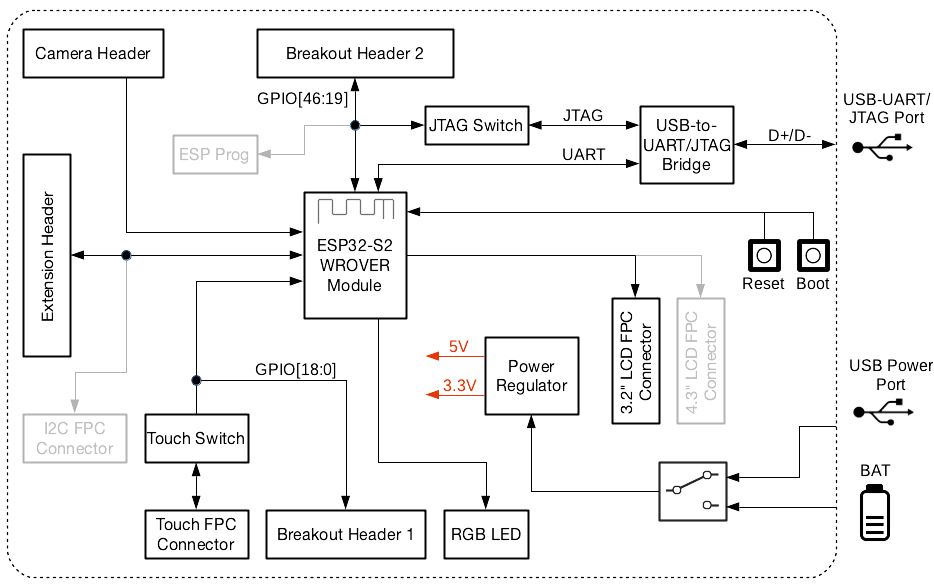

[Homepage](./index.md) > {{ page.title }}

# {{page.title}}

Diagrams play an important role in communicating complex technical information. They can be used to effectively and efficiently visualize hierarchies, circuits, communication processes, procedures, workflows, and any other interactions within or between different elements.

If you are writing technical text and find that expressing your ideas is getting increasingly harder (for instance, when describing logical connections), consider using a diagram. Even the most complex ideas that are hard to comprehend when written as text can be quickly comprehended with the help of a simple diagram. The key to success is to choose the appropriate diagram type for your case.

While creating your diagram, you might find that classification (see _Diagram Classification_) and examples do not provide you with a clear understanding of how to optimally organize your diagram and make it look professional. This chapter should give you a few insights.

## General Tips

Illustration of the general tips listed below:

- Arrange objects in a **logical manner** (see [Tips for block diagrams](#tips-for-block-diagrams)).
- Pay attention to the **amount of white space**.

  Minimal white space indicates that your diagram is cluttered. On the other hand, excessive white space makes connector lines unnecessarily long. Finding the right balance of white space in your diagrams is important as it helps to emphasize elements as well as balance out the arrangement of objects.

- Similar components should have **matching proportions**.
- To make **text readable**, keep enough white space between words and shapes.

  If an object has some text inside, leave enough white space around the text so that it does not appear crammed.

- Make sure that your diagram has **focal points**.

  Focal points draw the viewer's attention to the starting points from which the diagram should be read. Focal points also introduce a hierarchy and hint at logical connections between the elements. This is especially critical for large diagrams.

  Use the following techniques to introduce focal points:

  - dashed frames with a label; for better readability, labels should be in bold and located in the same corner of your frames (preferable top or bottom left corner)
  - font weight (bold, medium, regular)
  - different size of components

## Tips for block diagrams

Illustration of the diagram **not following the tips** below:

Illustration of the diagram **following the tips** below:

- Keep in mind that the purpose of a block diagram is to show how a device or a circuit operates, not how the physical components are arranged on a PCB; showing the actual physical arrangement is welcome as long as it does not complicate interconnections on the diagram.

- If you have an element to which most of the other components are connected (e.g., the CPU or ESP32 chip/module), consider surrounding such element with the connected components. This will help to better route the signals and avoid having unnecessarily long connector lines.

- To easier trace the connections, make connector lines with fewer bends (preferably straight) and avoid crossings.

- The flow of signals/information should be from top to bottom and from left to right (just like the stroke order in a Chinese character). In particular, try to place inputs on the left and outputs on the right.

- If some components are included but reserved for future use, grey them out on the diagram.
