## About Me

I am Kirill, a senior technical author. I immensely enjoy exploring various subject matters, building a holistic picture in my mind, and then putting disorganized, unstructured, or missing pieces of information together to form concise, scannable, user-friendly, and intuitive documentation.

Ideally, the more densely information is packed in as little content as possible, the better the documentation. This can be achieved through a combination of excellent writing skills, intuitive formatting, and the use of visuals. In this regard, I highly respect the recent trend of referring to us as technical communicators or technical authors. This trend indicates that we are not just writers of documentation, but those who utilize all modern means, such as diagrams, videos, interactive online widgets, etc. to quickly and efficiently get information across.

No doubt, creating effective documentation is important, but making the best use of it is even more important. It means that documentation needs to be accessible at the right place and at the right time. For this reason, I have also been actively studying [DocOps](https://www.writethedocs.org/guide/doc-ops/) -- tooling, maintenance, and deployment of documentation. This website is a manifestation of my efforts.

On top of that, I am also making steady progress in API documentation, knowledge management, project management, teaching technical writing, incessantly read new books and try to keep up with the latest trends in my field.

## My Career Path

I, so to speak, _coded_ it as a git graph using my favorite tool [Mermaid](https://mermaid.js.org/).

    My Career Path (click to enlarge)

## Portfolio Samples

As documentation development is a muti-faceted process, I list all my contributions under each writing sample respectively.

- [User Guide for a development board](https://docs.espressif.com/projects/esp-idf/en/latest/esp32s2/hw-reference/esp32s2/user-guide-esp32-s2-kaluga-1-kit.html)
  - The template for this document type was developed and standardized by me; now widely used.
  - I wrote this multipage user guide (main board and extension boards) following my template.
  - Terminology and taxonomy was developed and standardized by me.
  - To collect the initial data, I interviewed SMEs and tried the actual product.
  - Templates for diagrams and annotated images were improved and standardized by me based on the motley collection of styles that existed at that time.
  - The diagrams and annotated images were created by me following the respective templates, except for the source images of the product that a photographer took following my directions.
- [Content Functions](content-functions)
  - My attempt to adapt the Diátaxis framework to my current company's documentation.
- [Create Professionally Looking Diagrams](create-prof-looking-diagrams)
  - Excerpt from the guidelines accompanying the diagram templates.
  - All conceived and written by me from scratch.
- [LibreOffice Draw Cheatsheet](./images/libreoffice-draw-cheatsheet.pdf) (PDF)
  - Created using LibreOffice Draw to allow for the more complex formatting in tables.
  - All the tips were developed and incorporated into the diagram templates by me.
